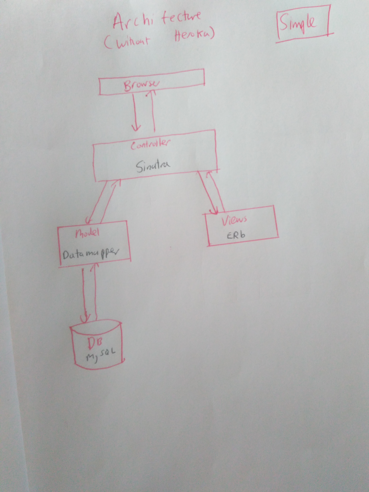
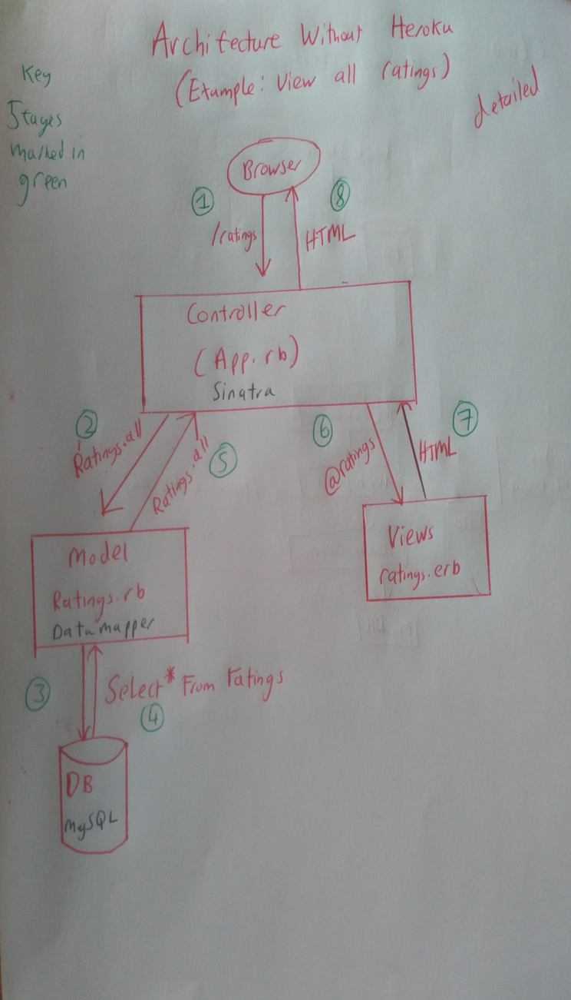

<h2 align="center"> FT Feedback Site </h2>
<h3 align="center"> Have a look at the new reviews site for the FT <a href='https://shrouded-mesa-54307.herokuapp.com/ratings/new'>here</a> </h3>

 <p align="center">  <a href='#scenario'>Scenario</a> |  <a href='#approach'>Approach</a>   |   <a href='#reflections'>Reflections</a> |   <a href='#version'>Versions</a> |  <a href='#use'>How to use</a>   |   <a href='#tech'>Tech</a> | <a href='#architecture'>Architecture</a>


## Scenario  <a name= "scenario"></a>

Build a website hosted in the cloud (e.g. AWS, Google, Heroku) that asks for and stores a simple
rating score for using ft.com

Provide a diagram of your site architecture showing key compnents that illustrate your approach.

*Extra*
 - Templated infrastructure as code  
 - Automated testing
 - Origami Compnents/FT look and feel
 - The ability to view the ratings/results

## Approach <a name= "approach"> </a>

#### Design
My focus is to break down the task into lots of smaller steps - to this I created versions, <a href='#version'>see below</a>, at the start of the project to act as checkpoints. My reasonsing for this, was rather than design everything in one go and then go off and code, I had clear points to stop, reflect and adapt my plans. Also by focusing on reaching the smaller targets, I keep my programme simpler to start with and if I turn out to do something badly, its easier to turn back and change.

This approach to design is something I am trialing so any feedback would be really helpful. In my commits I've tried to add explanations for the order of my decisions.

#### Tech
I decided to do the task in Ruby, as this website is quite light and I felt that doing it with Sinatra and Datamapper nice and simple tools for the job. This would give me space to challenge myself in other ways (particularly using AWS for the first time.) My original plan was to use AWS, but I set a fixed period of time to achieve this as I knew it could be tricky. In the end I deployed with Heroku, but you can read my  <a name= "reflections"> reflection</a> to see what I learnt and my reasoning to go to Heroku.

#### Targets (Written before starting) - no more than 4 points
- Only focus on reaching a checkpoint, don't worry about the extra complexity until you get there.
- Use AWS to deploy the website
- Keep it as simple as possible
- Reflect on my architecture and design frequently (especially at designated checkpoints) to check if there is any way of improving it further.

## Reflection <a name= "reflections"> </a>
I've been pleased with keeping the programme simple and leaving it extendable in the future. In terms of design, I found gradual increase rather than planning it all first worked well.

Part of me still thinks I should have gone with a JSON file or another file to store ratings, rather than a full MySQL database. However, I decided to stick with it, since I wanted to show I could integrate a website with a database on a cloud platform. But probably doing this again, I'd try just using something lighter to see how well this works.

Deployment has been my greatest challenge. I timeboxed a period to see if I could succeed in deploying to AWS. I've learnt alot about deployment, but I ended up pausing it as it was taking too long to achieve. This is something I want to explore more. One thing I would like to do is deploy a practise static site with no database first, and then practise hooking up a database. But I was glad I moved in small steps, as I only had to reset one step to go back to pre-aws attempts.

#### With more time I would have:
  - Built a sandbox project, deployed it to AWS and then deployed this site to AWS too (something
    I will be exploring further)
  - Integrated CI (I started to do this Travis, but there were issues with mySQL and it. So
    as it was extra I left it for if I had time.)
  - Added comments to the feedback
  - Read more about infrastructure as code

## Versions <a name= "versions"> </a>

V1: You are asked for a rating on a locally hosted website and it stores the ratings  
  - [x] You can visit a site
  - [x] You can submit a rating or any sort
  - [x] You can store the rating in a database
  - [x] Make it a single page site
  - [x] You can only add ratings of 1 - 5

V2: You are asked for a rating on a hosted website  (MVP)
  - [x] Deploy up the site on Heroku

V3: You can see previous (all ratings) on another page, previous ratings
  - [x] Second page with all previous ratings shown

V4: (Extras) Make it stylish, to look like the FT
  - [x] Add Origimi style
  - [x] Draw diagram of architecture of site
  - [x] Write reflections and tidy up readme
  - [x] Align everything in the site well
  - [x] Make the submit button look nicer and link to the next page
  - [x] Sort out the reviews page
  - [x] Upload diagrams

## How to use  <a name= "use"> </a>
First make sure you have Ruby 2.4.0+ and MySQL installed

#### Database setup
Then set up a Dev and Test database in the MySQL bash

```CREATE DATABASE ft_test;```
```CREATE DATABASE ft_development;```

I've called the user ft@localhost, you can either give this permissions to these two databases, or change the user in the models/ratings.rb file. Either way in my MySQL base:
```
GRANT ALL PRIVILEGES ON ft_test.* TO 'ft'@'localhost;'
GRANT ALL PRIVILEGES ON ft_development.* TO 'ft'@'localhost;' ```
```
#### Run site

1) Copy the repo ```git clone https://github.com/Tagrand/makers-cloud-engineering-exercise.git```
2) Go into the repo ```cd makers-cloud-engineering-exercise```
3) Install gems ```bundle```
4) Run the server ```rackup```
5) Visit [localhost:9292](localhost:9292) to see it all in glory!  

## Tech <a name= "tech"> </a>
Ruby
Sinatra   
MySQL
Heroku
Datamapper

## Architecture <a name= "architecture"> </a>
#### A few diagrams of the site structure (apologies for my handwriting!)




